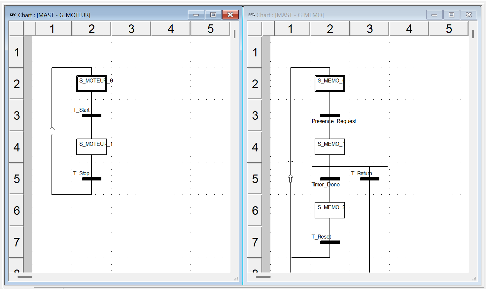

# 🚀 PLC Escalator Control System

**Demand-Driven Escalator with Retriggerable Memory Grafcet**  
*Schneider Control Expert (Unity Pro)*

---

### 📋 Project Description

Implementation of a realistic escalator control system using **Multi-Grafcet** techniques. The system uses a memory Grafcet (`G_MEMO`) with a 15-second retriggerable timer to validate passenger presence before allowing the escalator to start. A separate motor control Grafcet (`G_MOTEUR`) manages safe start/stop sequences with emergency priority.

*Figure 1: Full system running in Control Expert Simulator showing G_MEMO and G_MOTEUR coordination.*

---

### 🛠 Tech Stack & Tools

* **Software** : Schneider Control Expert v15 (Unity Pro)
* **Languages** : SFC (Grafcet), Ladder Logic (LD), Structured Text (ST)
* **PLC Target** : Modicon Premium TSX P57 2634M (Simulator)
* **HMI** : EcoStruxure Operator Terminal Expert

---

### 📂 Logic Architecture

| Component          | Language | Description                                      | Documentation |
|--------------------|----------|--------------------------------------------------|-------------|
| **G_MEMO**         | SFC      | Passenger detection + 15s retriggerable timer    | [View PDF](/Documentation/G_MEMO.pdf) |
| **G_MOTEUR**       | SFC      | Motor control (KM1/KM2) with safety logic        | [View PDF](/Documentation/G_MOTEUR.pdf) |
| **TIMERS**         | Ladder   | TON 15-second presence validation                | [View PDF](/Documentation/TIMERS.pdf) |
| **init_logic**     | Ladder   | Cold start + manual reset (INITCHART)            | [View PDF](/Documentation/init_logic.pdf) |
| **LOGIC_MOTEUR**   | ST       | Safety logic and output management               | [View PDF](/Documentation/LOGIC_MOTEUR.pdf) |

---

### 🎯 Key Features

- Safe passenger presence validation with retriggerable 15s timer
- Emergency stop priority (BPA) with fault indication (`H_FLT`)
- Proper system reset when passenger leaves or emergency occurs
- Professional supervision screen (HMI)
- Full animation table for debugging and validation

---

### 📹 Mission Validation (Live)

Watch the logic in motion via the Control Expert Simulator:

* 🎞️ **[Normal operation with presence detection](./Visuals/Running_State.mp4)**
* 🛑 **[Emergency stop behavior](./Visuals/Emergency_Stop.mp4)**

---

### 🚀 Usage / How to Restore

1. Open Schneider Control Expert.
2. Go to **File > Restore Archive...** and select the `.stu` file from `Logic_Source/`.
3. Go to **Build > Rebuild All Project**.
4. Connect to the **PLC Simulator**, transfer the project, and set to **Run**.
5. Use the **Animation Table** to monitor key variables.

---

### 🎓 Academic Context

This project was developed as part of the **TSAII** coursework using the official teaching materials and exercises provided by AFPI Dunkerque (BTS CIRA program). It follows the same methodology and requirements as the previous Multi-Grafcet implementations.

*For detailed credits regarding the TSAII course material, exercises and PDFs, please refer to the [CREDITS.md](CREDITS.md) file.*

---

**Made with determination ❤️**
